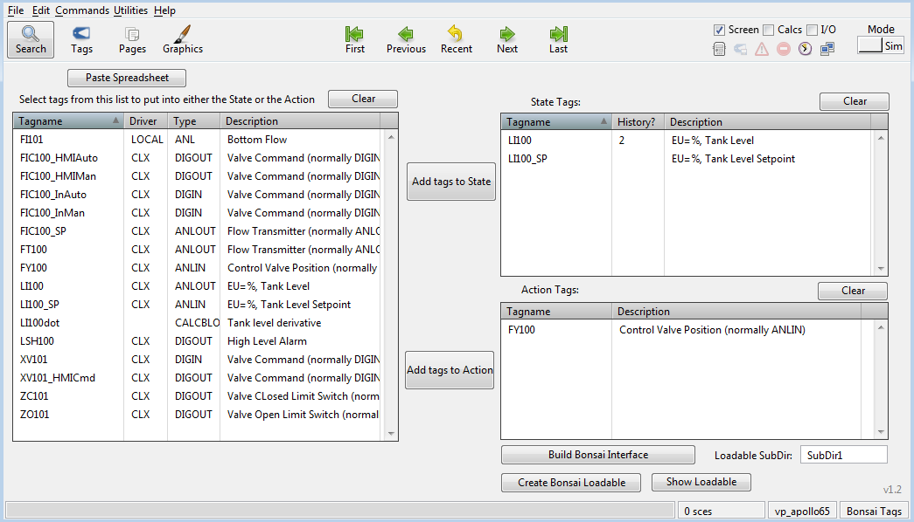
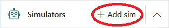
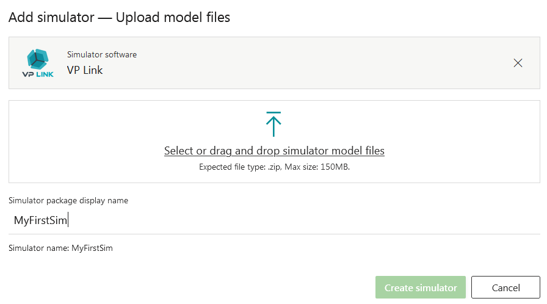
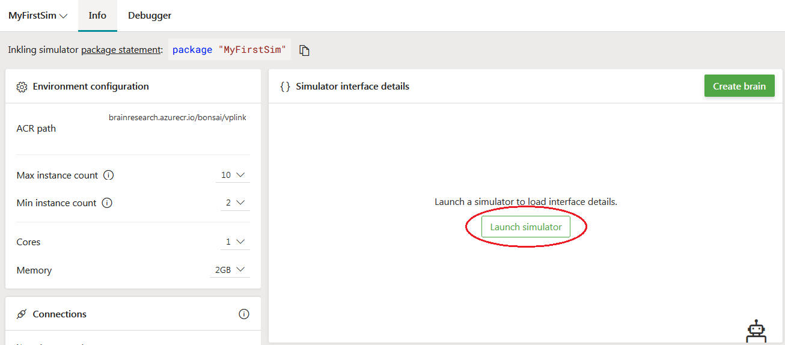
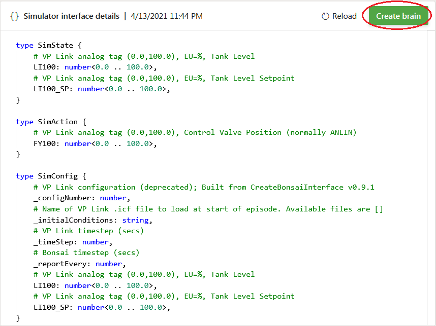

# VP Link connector

A collection of tools and sample files allowing users to run VP Link simulations with [Microsoft Project Bonsai](https://azure.microsoft.com/en-us/services/project-bonsai/).

Existing VP Link users can utilize these [tools](tools/README.md) to create their own VP Link loadable files which can be used to create a scalable VP Link simulation on the bonsai web site.

Other users can use the [samples](samples/README.md) and documentation to experiment with creating a brain to control any of the samples.

## Installation

VP Link Users:
* Copy the executables to the CapeSoftware\VPLink3 directory.

* Use the Bonsai Tag Integration page from a Bonsai-enabled .rev file to add VP Link tags to your SimState and SimAction structures.
* You can connect your local VP Link simulation to Bonsai as an unmanaged simulator to experiment with training a brain with the VPLinkSim_Bonsai3.exe program.
* Once you have your local VP Link simulation working with Bonsai, use the
Bonsai Loadable page from the Bonsai.rev file to create your customized VP Link loadable on your local machine.
* [Add a Simulator](#usage-adding-a-vp-link-simulator-to-your-workspace) to your workspace by uploading the loadable to the Bonsai web site and train a brain at scale.


Other Users:
* Browse the documentation and use one of the existing [sample simulations](samples/README.md) to explore how to train a brain with the Inkling language.
* [Add a Simulator](#usage-adding-a-vp-link-simulator-to-your-workspace) to your workspace by uploading the loadable to the Bonsai web site and train a brain at scale.

## Concepts: What is a VP Link loadable?

A VP Link loadable is a file that contains the model-specific information needed for the simulation to run on the bonsai web site.
It is a zip file that contains the following information:
* A VP Link .tag file which has the model configuration in it.
* A vplink_interface.json file which describes which VP Link tags will be used in the SimState and SimAction structures.
* Any other VP Link .icf files which the user wants to use to set the initial conditions of the model at the start of an episode.

The structure of the sim.zip file is fixed.  The vplink_interface.json needs to be at the root level of the .zip file.
Any VP Link .tag files or .icf files go in a ./cfg/ directory under the root.  Any .tag files present in the ./cfg/ directory
will be loaded into the VP Link simulator.  The .icf files are made available for the user to load at the start of an episode.

```
sim.zip
├── vplink_interface.json
├── cfg/
|   ├── ... TAG files ...
|   └── ... ICF files ...
├── sces/
|   └── ... Scenario files ...
├── data/
|   └──... Other Data (not used yet) ...
```

## Usage: Running a local simulator

If you have VP Link running on your local machine, you can use the VPLinkSim_Bonsai3.exe program to connect your simulation to the Bonsai web site.  This will show up as an unmanaged
sim with the name, VPLink3b.  The advantages of running the simulator locally are:
* You can monitor what is happening with your VP Link interface.
* You can make changes to the simulator very quickly as needed to support the simulation.  This includes adjusting ranges, adding
new tags, etc.
* You can save new initial condition files (.icf) to support your needed starting states for various lessons as you train the brain with the simulation.
* You can change the tags that are included in the SimState and SimAction structures.


## Usage: Adding a VP Link simulator to your workspace

You can easily add a VP Link simulator to your Bonsai workspace using the built-in VP Link simulator.
You should have a VP Link loadable ready to upload.  Either use one of the samples, or if you have VP Link running locally,
create one from your running VP Link model using CreateBonsaiInterface.exe and CreateBonsaiLoadable.exe. Even better, use a
Bonsai-enabled VP Link interface to create your customized loadable file. 

* From the bonsai web page, click the Add Simulator button in the left panel.  
* Choose the VP Link simulator.  You will see a window where you can upload your VP Link loadable. 
* Upload your VP Link loadable by dragging it from your local machine to the window.  Give the simulator a name and click the "Create Simulator" button.
You will see the bonsai platform creating your simulator image.  In a minute or two you will see the simulator in your list of simulators on the bonsai web page.
* Launch the simulator to automatically generate the interface Inkling code for the SimState, SimAction and SimConfig corresponding to
the model you have uploaded.  
* Once your interface Inkling is generated, use the "Create Brain" button to automatically create some template Inkling code to use as a start to train a brain.


## Samples

Use these links to explore the sample VP Link models you can use to train a Bonsai brain.

* [Simple tank level control](samples/simpletank/README.md).  A good place to start training your first Bonsai brain.
* [Quad-tank model](samples/quadtank/README.md).  A well-studied problem with a larger state space for Bonsai to explore.
* [Enzyme Bug Reactor](samples/bugreactor/README.md).  Sample bioreactor illustrating deadtime and unmeasured process variables to control.

## Trademarks

This project may contain trademarks or logos for projects, products, or services. Authorized use of Microsoft
trademarks or logos is subject to and must follow
[Microsoft's Trademark & Brand Guidelines](https://www.microsoft.com/en-us/legal/intellectualproperty/trademarks/usage/general).
Use of Microsoft trademarks or logos in modified versions of this project must not cause confusion or imply Microsoft sponsorship.
Any use of third-party trademarks or logos are subject to those third-party's policies.
