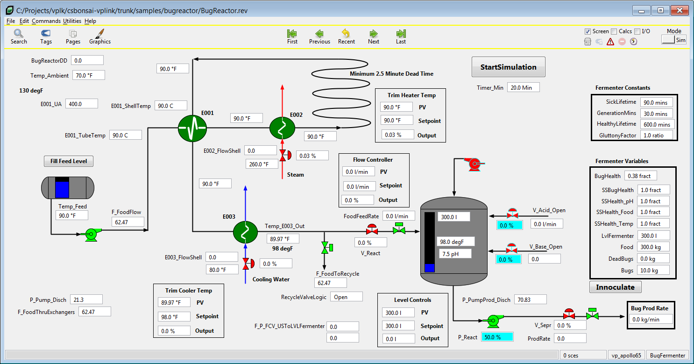
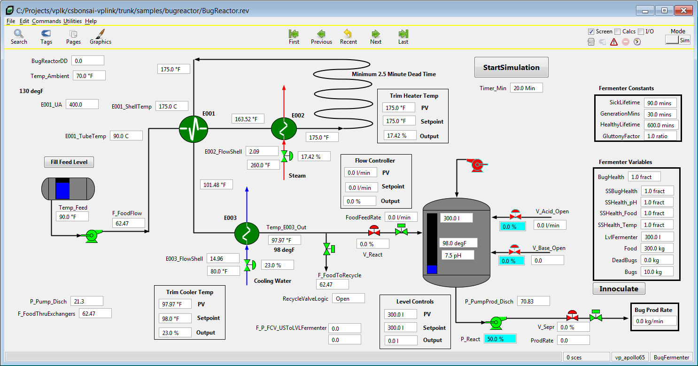
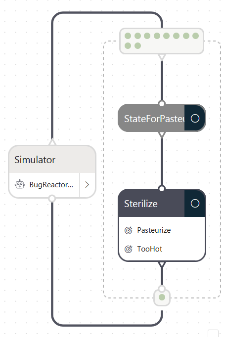

# Bug Reactor VP Link model

> The BugReactor project is being renamed to EnzymeReactor.  Updates will be maintained in the [enzymereactor](../samples/enzymereactor) folder.

The Bug Reactor model demonstrates various control loops that need to work in a coordinated fashion.  This is a model of an industrial
bioreactor used to produce enzymes.  The enzymes are produced by laboratory organisms grown in a continuous fermenter.  There are
two main control issues;
1. Maintain the sterility of the feed using a pasteurization loop.  This introduces deadtime to the temperature controller.  This is
complicated by the fact that there is a time vs. temperature relationship that must be maintained in the pasteurization loop.
2. Maintain the optimal concentration of organisms in the reactor.  This is not measured directly but can be inferred from
other process measurements including the production rate of bugs.

The process is illustrated below.  Your mission, should you choose to accept it, is to build a brain
that maintains the pastuerization of the feed as well as the optimum concentration of bugs in the reactor for maximum production.
Use the supplied [VP Link loadable](bugreactor_sim.zip) to create your Bonsai Simulator.
Read the supplied [process description](BugReactorExplanation.pdf) for more information about how the process works to guide you in your journey.

Hint:  Consider tackling this problem with two different brains.

The image below shows the bug reactor working at close to optimial conditions.


## State Tags
* LvlFermenter -- Volume of material in the fermenter
* Reactor_Temp -- Temperature of the fermentor
* Reactor_pH   -- pH of the fermenter
* Temp_E003_Out -- Temperature of fermenter feed
* BugsProdRate  -- Production rate of bugs
* FoodFeedRate  -- Flowrate of food to the fermenter
* Temp_E001_ShellIn\[4\] -- Outlet temperature of pasteurization loop

## Action Tags
* V_Acid_Open_Vlv -- Valve supplying acid to the fermenter
* V_Base_Open_Vlv -- Valve supplying base to the fermenter
* LvlFermenter_SP -- Setpoint for the level in the fermenter
* FlowSetPoint   -- Setpoint for the feed flow to the fermenter
* TempCWSetPoint -- Setpoint for the fermenter feed temperature
* TempSetPoint   -- Septoint for the pasteurization inlet temperature

There used to be two different samples here, bugreactor-temp_sim.zip and bugreactor-rxn_sim.zip, but
now that is replaced by one loadable, bugreactor_sim.zip.  The loadable has three separate .ICF files
which you can use to initialize the model to one of three states.  This means you can use the same sim to train
your bugreactor brains.

## Initial Conditions Files
* PasteurizationStartup.icf -- The pasteurization loop is at 90 degrees, no flow to the reactor, so all the flow is recycling to the feed tank.
Start here to train a brain to get the pasteurization loop up to a stable 175 degrees throughout, as fast as possible.

* ReactorStartup.icf -- The pasteurization loop is stable at 175 degrees.  There is no flow to the reactor.  The reactor has 300 l in it, there
is 300 kg of food.  The reactor has just been innoculated with 10 kg of bugs.  Start here to train a brain to maximize the production rate of bugs.

* ReactorOperation.icf -- The reactor is running at a pretty decent production rate of bugs.
* Magic_pH_Control.icf -- Add this to your \_initialconditions: SimConfig member if you don't want to worry about
the pH control in the reactor.  This is a good idea until you get a brain trained that will do the pH controls.

## Things to consider
* How long should a brain training episode be in simulated time?


# Learning with the Sample1 inkling
The BugReactor_Sample1.ink file is a place to start to train a brain on a part of this process. The Sample1 file starts with the
pasteurization loop.  This is a very simple design which will need some changes before it trains well.  Create a sim using the
VP Link simulator and the sample loadable file in this directory.  If you are not sure how to do this, go back and run through the
SimpleTank example.

After you get your sim created, paste the package statement into the Simulator definition on line 71.  At this point, you should be able to
train a brain, but please invest a few more minutes to save yourself a lot of brain training time.

## Improving the Inkling
If you tried to train a brain using the Sample1 inkling, you probably realized it did not train very well.  Why?  Because that
sample is not a very good teacher.  Let's examine why.

### Narrow the SimAction

In this example, there are six members in the SimAction structure.  You are asking the brain to control a temperature by manipulating 6 variables.
In reality, there is only one that needs to be manipulated, and that is the TempSetPoint.  So as your first improvement, comment out all the
uneeded members of the SimAction structure.  You may also want to narrow the range of the output to some more reasonable values instead of
0..200.  There is really no process reason why that setpoint value would ever be, say, less than 100.  You should end up with something like this:

```inkling
type SimAction {
    ## VP Link analog tag (0.0,100.0), Eu=%;
    #V_Acid_Open_Vlv: number<0.0 .. 100.0>,
    ## VP Link analog tag (0.0,100.0), Eu=%;
    #V_Base_Open_Vlv: number<0.0 .. 100.0>,
    ## VP Link analog tag (0.0,2000.0), EU=l; Setpoint for Level in the Fermenter (normally 300)
    #LvlFermenter_SP: number<0.0 .. 2000.0>,
    ## VP Link analog tag (0.0,130.0), EU=l/min;
    #FlowSetPoint: number<0.0 .. 130.0>,
    ## VP Link analog tag (0.0,200.0), Eu=°F;
    #TempCWSetPoint: number<0.0 .. 200.0>,

    # VP Link analog tag (0.0,200.0), Eu=°F;
    TempSetPoint: number<100.0 .. 200.0>,
}

```

Now Bonsai will have a much easier time trying to figure out what to change in order to affect the process.  This exercise brings up a very interesting point
about the interface to the VP Link simulator.  Remember that the SimAction, SimState and SimConfig are all pre-built for you from the VP Link loadable file
that you use to create the sim in the first place.  But because of the flexibility of the VP Link design, only the SimState needs to match what was in the original
loadable at run time.  So you are free to change the SimAction and the SimConfig structures (keep the required SimConfig members that start with an underscore)
when you train your brain. This feature means you do not have to go back to VP Link to rebuild your loadable if you want to make such a change.

If you *do* need to change the SimState, go to the Azure Marketplace and spin up an instance of the VP Link for Cloud Development.  This gives you access to
VP Link software and the Bonsai loadable creation tools to change the elements in the SimState.  You can even change up the simulation model itself and create
your own, updated loadable file.

> The VP Link for Cloud Development is currently in preview only to a limited audience.  This is coming soon.

### Narrow the SimState

> While the following instrucions do the job, we are working on a better, more concise mechanism to do the same thing.

This is a classic way to improve brain training performance.  Since the SimState includes all sorts of variables that do not pertain to the pasteurization step,
it is advantageous to remove these from the state that is passed to the Sterilize concept.  You can do this with a programmed concept.  The programmed concept will
take the large SimState and return a new state, called PasteurizeState.  This new state will only have the variables necessary for the Sterilize concept to do its job.
Note that the FoodFeedRate was left in this new state just in case the action of the temperature controller is affected by the flowrate of material through the sterilizer.
Copy the code below right above the graph statement.

```inkling
type PasteurizeState {
    Temp_E003_Out: number<0.0 .. 300.0>,
    # VP Link analog tag (0.0,1000.0), EU=kg/min; Production rate of bugs
    FoodFeedRate: number<0.0 .. 130.0>,
    # VP Link analog tag (0.0,300.0), Eu=°F;
    Temp_E001_ShellIn: number<0.0 .. 300.0>[4],
}

function ReducePasteurizeState(s: SimState) : PasteurizeState
{
    return {
        Temp_E003_Out: s.Temp_E003_Out,
        FoodFeedRate: s.FoodFeedRate,
        Temp_E001_ShellIn: s.Temp_E001_ShellIn,
    }
}
```

Now what we want to do is to put this concept just in front of the Sterilize concept in the concept graph.
Add these statements just after the "graph" statement and before the "concept Sterilize" statement:

```
    concept StateForPasteurization(input): PasteurizeState {
        programmed ReducePasteurizeState
    }
```

We will need to modify the "concept Sterilize" statement in two ways.
  1) Tell it to use the PasteurizeState which is the output of the StateForPasteurization concept, and
  2) Since there are two concepts now, the brain needs to know which one will output the final action.

Replace the 'input' parameter with the name of the previous concept--in this case StateForPasteurization.  That handles
the change #1. Also include the 'output' modified to the Sterilize concept--this handles the second necessary change.
You can replace the 'concept Sterilization' statement with the one below.

```
    output concept Sterilize(StateForPasteurization): SimAction {
```

At this point, the graph of your brain design should look like this, and you can train it again.



### Change the reward function

You may find that the brain is stil not performing well.  It might eventually heat up the material well, but is really
does not keep the temperature very close to the setpoint.  In this case we need to revise the incentive with a customied
reward function.  You may have noticed that there are two functions in the Inkling code not previously mentioned.
The VPLinkReward is a generalized function that has proven useful in a number of situations like this.  The
PasteurReward is a specific implmentation of the VPLinkReward that is applicable for this situation.  To use
these in the your brain, you will need to uncomment the 'reward' statement.  Because you can only use either
goals or reward functions, your will also need to comment out the goal statement.

```
      reward PasteurReward

      # Add goals here describing what you want to teach the brain
      # See the Inkling documentation for goals syntax
      # https://docs.microsoft.com/bonsai/inkling/keywords/goal
      # goal (s: SimState)
      # {
      #     # Get within 1 degree of the target
      #     drive Pasteurize: s.Temp_E001_ShellIn[0] in Goal.Sphere(kLearnToKeepWarm, 1)
      #  	avoid TooHot: s.Temp_E001_ShellIn[0] in Goal.RangeAbove(kTooHot)
      # }
```

Now try training the brain and seeing if you get better results.


# Learning more Inkling concepts

> There is a *lot* more to come with this example, as its complexity can exercise many aspects of bonsai and the Inkling language. Watch this space for more
examples of how to train a complex brain to control other elements of this problem.

# Other Resources

[Writing Reward Functions Video](https://medium.com/@BonsaiAI/reward-functions-writing-for-reinforcement-learning-video-85f1219a0bde)
