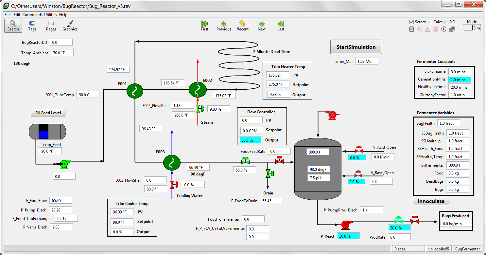

# Bug Reactor VP Link model

> A viable Bonsai brain design suitable for a "sample" has not been completed for this simulation at this time.
Brain designs are still in progress, so a sample
loadable with specific State and Action tags that will work is not yet available.  The two loadables are the current best effort.
You have been warned.

The Bug Reactor model demonstrates various control loops that need to work in a coordinated fashion.  This is a model of an industrial
bioreactor used to produce enzymes.  The enzymes are produced by laboratory organisms grown in a continuous fermenter.  There are
two main control issues;
1. Maintain the sterility of the feed using a pasteurization loop.  This introduces deadtime to the temperature controller.  This is
complicated by the fact that there is a time vs. temperature relationship that must be maintained in the pasteurization loop.
2. Maintain the optimal concentration of organisms in the reactor.  This is not measured directly but can be inferred from other process measurements.

The process is illustrated below.  Your mission, should you choose to accept it, is to build a brain
that maintains the pastuerization of the feed as well as the optimum concentration of bugs in the reactor for maximum production.
Use the supplied [VP Link loadable](bugreactor-temp_sim.zip) to create your Bonsai Simulator.  Until the warning above regarding the state of this brain design is removed,
it is likely that only those with access to VP Link will be able to create the proper SimState and SimAction structures for a viable brain design.
Read the supplied [process description](BugReactorExplanation.pdf) for more information about how the process works to guide you in your journey.

Hint:  Consider tackling this problem with two different brains.

## State Tags
* Temp_E002_In -- Feed inlet temperature to E002
* Temp_E002_Out -- Temperature at inlet of pasteurization loop
* Temp_E001_ShellIn\[10\] -- Outlet temperature of pasteurization loop
* F_FoodFlow -- flow of feed through E001 and E002
* TempSetpoint -- Desired temperature at inlet to pasteurization loop

## Action Tags
* HeatIn -- Steam valve position supplying heat to E002

There are two different samples here, bugreactor-temp_sim.zip and bugreactor-rxn_sim.zip.

