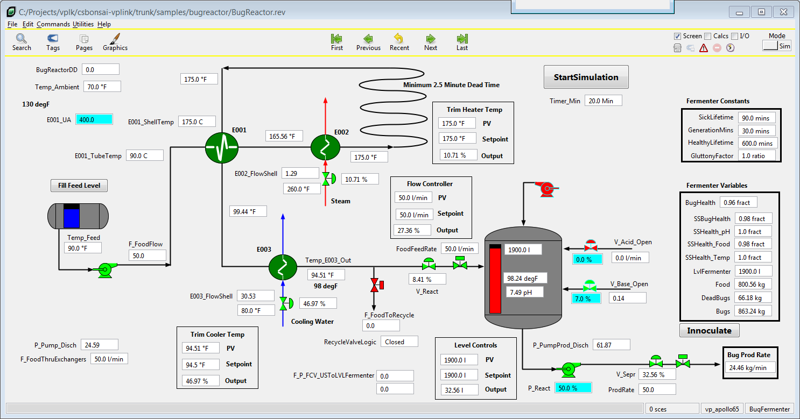

# Bug Reactor VP Link model

> A viable Bonsai brain design suitable for a "sample" has not been completed for this simulation at this time.
Brain designs are still in progress, so there is not a sample Inkling file, but a sample
loadable with specific State and Action tags that will work is now available.  See the mention of Initial Conditions
to choose the appropriate initial state of the model for the brain you are training.

The Bug Reactor model demonstrates various control loops that need to work in a coordinated fashion.  This is a model of an industrial
bioreactor used to produce enzymes.  The enzymes are produced by laboratory organisms grown in a continuous fermenter.  There are
two main control issues;
1. Maintain the sterility of the feed using a pasteurization loop.  This introduces deadtime to the temperature controller.  This is
complicated by the fact that there is a time vs. temperature relationship that must be maintained in the pasteurization loop.
2. Maintain the optimal concentration of organisms in the reactor.  This is not measured directly but can be inferred from
other process measurements including the production rate of bugs.

The process is illustrated below.  Your mission, should you choose to accept it, is to build a brain
that maintains the pastuerization of the feed as well as the optimum concentration of bugs in the reactor for maximum production.
Use the supplied [VP Link loadable](bugreactor_sim.zip) to create your Bonsai Simulator.
Read the supplied [process description](BugReactorExplanation.pdf) for more information about how the process works to guide you in your journey.

Hint:  Consider tackling this problem with two different brains.

The image below shows the bug reactor working at close to optimial conditions.

## State Tags
* LvlFermenter -- Volume of material in the fermenter
* Reactor_Temp -- Temperature of the fermentor
* Reactor_pH   -- pH of the fermenter
* Temp_E003_Out -- Temperature of fermenter feed
* BugsProdRate  -- Production rate of bugs
* FoodFeedRate  -- Flowrate of food to the fermenter
* Temp_E001_ShellIn\[4\] -- Outlet temperature of pasteurization loop

## Action Tags
* V_Acid_Open_Vlv -- Valve supplying acid to the fermenter
* V_Base_Open_Vlv -- Valve supplying base to the fermenter
* LvlFermenter_SP -- Setpoint for the level in the fermenter
* FlowSetPoint   -- Setpoint for the feed flow to the fermenter
* TempCWSetPoint -- Setpoint for the fermenter feed temperature
* TempSetPoint   -- Septoint for the pasteurization inlet temperature

There used to be two different samples here, bugreactor-temp_sim.zip and bugreactor-rxn_sim.zip, but
now that is replaced by one loadable, bugreactor_sim.zip.  The loadable has three separate .ICF files
which you can use to initialize the model to one of three states.  This means you can use the same sim to train
your bugreactor brains.

## Initial Conditions Files
* PasteurizationStartup.icf -- The pasteurization loop is at 90 degrees, no flow to the reactor, so all the flow is recycling to the feed tank.
Start here to train a brain to get the pasteurization loop up to a stable 175 degrees throughout, as fast as possible.

* ReactorStartup.icf -- The pasteurization loop is stable at 175 degrees.  There is no flow to the reactor.  The reactor has 300 l in it, there
is 300 kg of food.  The reactor has just been innoculated with 10 kg of bugs.  Start here to train a brain to maximize the production rate of bugs.

* ReactorOperation.icf -- The reactor is running at a pretty decent production rate of bugs.
* Magic_pH_Control.icf -- Add this to your \_initialconditions: SimConfig member if you don't want to worry about
the pH control in the reactor.  This is a good idea until you get a brain trained that will do the pH controls.

## Things to consider
* How long should a brain training episode be in simulated time?

