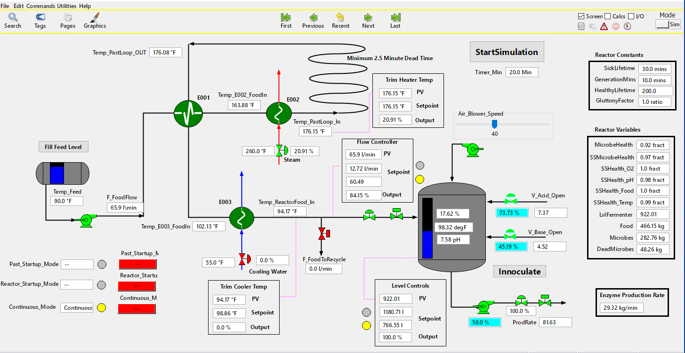

# Enzyme Reactor VP Link model


The Enzyme Reactor model demonstrates various control loops that need to work in a coordinated fashion.  This is a model of an industrial
bioreactor used to produce enzymes.  The enzymes are produced by laboratory organisms grown in a continuous fermenter.  There are
two main control issues;
1. Maintain the sterility of the feed using a pasteurization loop.  This introduces deadtime to the temperature controller.  This is
complicated by the fact that there is a time vs. temperature relationship that must be maintained in the pasteurization loop.
2. Maintain the optimal concentration of organisms in the reactor.  This is not measured directly but can be inferred from
other process measurements including the production rate of enzymes.

The process is illustrated below.  The challenge is to build a brain that maintains the pastuerization of the feed as well as the optimum 
concentration of microbes in the reactor for maximum production. Within this problem there are effectively three 'phases' of the reactor
control that need treated differently, pasteurisation startup, reactor startup and continuous enzyme production.
Use the supplied [VP Link loadable](enzymereactor_sim.zip) to create your Bonsai Simulator.
Read the supplied [process description](EnzymeReactorExplanation.pdf) for more information about how the process works.


The image below shows the enzyme reactor working at close to optimial conditions.


## State Tags
* Continuous_Mode -- Continuous Mode status
* Past_Startup_Mode -- Pasteurisation Startup Mode status 
* Reactor_Startup_Mode -- Reactor Startup Mode status 
* Continuous_Mode_Button -- Button to engage Continuous Mode 
* Reactor_Startup_Mode_Button -- Button to engage Reactor Starup Mode 
* Microbes -- Total amount of Microbes in the Reactor 
* Food -- Total Amount of Food in the Reactor 
* Reactor_O2 -- Reactor Dissolved Oxygen % 
* Reactor_Temp -- Reactor Temperature 
* Reactor_pH -- pH in Reactor
* Temp_E002_FoodIn -- Temperature of food inlet to Steam Heater 
* Temp_E003_FoodIn -- Temperature of food feed 
* Temp_PastLoop_In -- Temperature into Pasteurisation loop 
* Temp_PastLoop_OUT -- Temperature out of Pastuerisation loop
* Temp_ReactorFood_In -- Temperature of feed into reactor 


## Action Tags
* V_Acid_Open_Vlv -- Acid Valve 
* V_Base_Open_Vlv -- Base Valve 
* Reactor_Level_Setpoint_St -- Setpoint of Reactor Level Controller When in Reactor Startup Mode 
* Reactor_Level_Setpoint_C -- Setpoint of Reactor Level Controller When in Continuous Mode 
* FlowSetPoint_St -- Setpoint of Feed Flow Controller When in Reactor Startup Mode 
* FlowSetPoint_C -- Setpoint of Feed Flow Controller When in Continuous Mode 
* ReactorFoodInlet_PastLoop_TempSetpoint -- Setpoint of Trim Cooler Temperature Controller 
* PastLoop_TempSetpoint -- Setpoint of Steam Heater Temperature Controller
* Air_Blower-Speed -- Air flow into reactor 


## Initial Conditions Files
* PasteurizationStartup.icf -- The pasteurization loop is at 90 degrees, no flow to the reactor, so all the flow is recycling to the feed tank.
Start here to train a brain to get the pasteurization loop up to a stable 170 - 175 degrees throughout, as fast as possible.

* ReactorStartup.icf -- The pasteurization loop is stable at 175 degrees.  There is no flow to the reactor.  The reactor has 400 l in it, there
is 400 kg of food.  The reactor has just been innoculated with 10 kg of microbes.  Start here to train a brain to build a population of microbes 
in the reactor .

* Continuous.icf -- The reactor is continuously producing enzymes and reactor conditions are in a good state. Start here to train a brain 
to continue producing enzymes while maintaining good reactor conditions for microbe growth


* PasteurisationRampinFlow.icf -- A flow disturbance for the pastuerisation loop to deal with
* PasteurisationRampdown.icf -- Another flow disturbance for the pastuerisation loop to deal with

## Things to consider
* How long should a brain training episode be in simulated time?
* How best to structure the brain? Should multiple concepts be used?


# Learning with the Sample1 inkling
The EnzymeReactor_Sample1.ink file is a place to start to train a brain on a part of this process. The Sample is an example of a multi-concept
brain that uses different concepts and rewards for different phases of the reactor control.  Create a simulator using the
VP Link simulator and the sample loadable file in this directory.  If you are not sure how to do this, go back and run through the
SimpleTank example.

After you get your sim created, paste the package statement into the Simulator definition on line 71.  At this point, you should be able to
train a brain, but please invest a few more minutes to save yourself a lot of brain training time.

## Understanding the Inkling
The sample inkling contains a number of features not present in other VP Link examples, these are present due to the complexity of the control problem.


### Why Multiple Concepts?

The Enzyme reactor problem has three distinct phases to it that all have different starting and end points. When confronted by a problem like this 
Bonsai needs to learn to do different actions for different states and it is often not effective or possible to program that learning into one 
concept. In this sample the three concepts are ReactorStartup, SterlisationStartup and Continuous to deal with the three distinct phases.

The action space for these concepts is split up into actions that are relevant for that concept. For Example the continuous action space uses
variables that act on the reactor only.

```inkling
#define the Reactor Continuous narrowed Action space
type ContinuousAction {
    # VP Link analog tag (0.0,2000.0), EU=l; Setpoint for Level in the Fermenter (normally 300)
    Reactor_Level_Setpoint_C: number<300.0 .. 1800.0>,
    # VP Link analog tag (0.0,200.0), Eu=°F;
    ReactorFoodInlet_PastLoop_TempSetpoint: number<0.0 .. 200.0>,
    # VP Link analog tag (0.0,100.0), Eu=%;
    Acid_Flow_Vlv: number<0.0 .. 100.0>,
    # VP Link analog tag (0.0,100.0), Eu=%;
    Base_Flow_Vlv: number<0.0 .. 100.0>,
    # VP Link analog tag (0.0,100.0), 
    Air_Blower_Speed: number<0.0 .. 100.0>,
    # VP Link analog tag (0.0,130.0), EU=l/min;
    FlowSetPoint_C: number<0.0 .. 130.0>,
}

```

You will notice that different simulator packages need to be specified in order to use different action spaces.

```inkling
simulator ContinuousSimulator(action: ContinuousAction, config: SimConfig): SimState {
    # Automatically launch the simulator with this
    # registered package name.
    package "EnzymeReactorFinal"
}

```

Bonsai can of course only use one concpet output, and in this particular example two of the concepts use some of the same actions (i.e. those
related to the reactor). The final selector concept uses the known process state to decide which set of actions to use. This functions as 
a concept that both selects and combines the output. To learn more about concepts go to 
https://docs.microsoft.com/en-us/bonsai/inkling/keywords/concept


```inkling
    concept CombineActions (input,  Continuous, ReactorStartup, SterilisationStartup) : SimAction{
        programmed    function (state: SimState,  c: ContinuousAction, r: ReactorStartupAction, Pt: SterilisationAction) { 
                if state.Reactor_Startup_Mode == 1 {
            return {
                Reactor_Level_Setpoint_C: c.Reactor_Level_Setpoint_C,
                Reactor_Level_Setpoint_St: r.Reactor_Level_Setpoint_St,
                PastLoop_TempSetpoint: Pt.PastLoop_TempSetpoint,
                ReactorFoodInlet_PastLoop_TempSetpoint: r.ReactorFoodInlet_PastLoop_TempSetpoint,
                Acid_Flow_Vlv: r.Acid_Flow_Vlv,
                Base_Flow_Vlv: r.Base_Flow_Vlv,
                Air_Blower_Speed: r.Air_Blower_Speed,
                FlowSetPoint_C: c.FlowSetPoint_C,
                FlowSetPoint_St: r.FlowSetPoint_St
                        }
                }
                   
        return {
            Reactor_Level_Setpoint_C: c.Reactor_Level_Setpoint_C,
            Reactor_Level_Setpoint_St: r.Reactor_Level_Setpoint_St,
            PastLoop_TempSetpoint: Pt.PastLoop_TempSetpoint,
            ReactorFoodInlet_PastLoop_TempSetpoint: c.ReactorFoodInlet_PastLoop_TempSetpoint,
            Acid_Flow_Vlv: c.Acid_Flow_Vlv,
            Base_Flow_Vlv: c.Base_Flow_Vlv,
            Air_Blower_Speed: c.Air_Blower_Speed,
            FlowSetPoint_C: c.FlowSetPoint_C,
            FlowSetPoint_St: r.FlowSetPoint_St
                }
            }
        }
		
```

### Domain Randomisation

You will see that the VP Link training episodes use a VP Link initial conditions file (.icf file) for the first training lesson. This will
set the starting conditions for each episode. Bonsai will be able to learn well from this starting point, however it may learn ***too*** well
and be able to deal with situations that have slightly different starting conditions.

Too combat this domain randomisaiton is used. A second lesson that provides a range of starting points for certain variables is included. 
an initial conditions file is still utilised however variables also specified in the lesson will overwrite those in the .icf file at the 
start of each episode. Domain randomisation makes the brain more robust for real world deployment. 

```inkling
 lesson MoreVariedStart {
                scenario {
                    _configNumber: 0,
                  # Each episode will use the same starting conditions
                    _initialConditions: "ReactorStartup.icf",
                    _timeStep: 2,  # VP Link model takes 2 second time steps (for the PIDs to work well)...
                    _reportEvery: 30,  # but reports to Bonsai after 30 seconds of sim time has elapsed. 
                    LvlFermenter: number<300.0 .. 600.0>,
                    Reactor_Startup_Mode: number<1>,
                    Reactor_O2: number<15.0 .. 20.0>,
                    Reactor_Temp: number<94.0 .. 102.0>,
                    Reactor_pH: number<7.2 .. 7.8>,
         
                }
            }
```

### Narrow the State Space


This is a classic way to improve brain training performance.  Since the SimState includes all sorts of variables that do not pertain to the pasteurization step,
it is advantageous to remove these from the state that is passed to the Sterilize concept.  You can do this with a programmed concept.  The programmed concept will
take the large SimState and return a new state, called PasteurizeState.  This new state will only have the variables necessary for the SterilisationStartup concept to do its job.

```inkling
#define the narrowed state space for Pastuerisation
type PasteurizeState {
    Past_Startup_Mode: number<0 .. 1>,
    # VP Link digital tag (--,ReactorStartup), 
    Temp_PastLoop_In: number<0.0 .. 300.0>[3],
    # VP Link analog tag (0.0,300.0), Eu=°F;
    Temp_PastLoop_OUT: number<0.0 .. 300.0>[3],
}
#This function will be used in the pasteurisation concept to reduce the overall state space
function ReducePasteurizeState(s: SimState) : PasteurizeState
{
    return {
        Past_Startup_Mode: s.Past_Startup_Mode,
        Temp_PastLoop_In: s.Temp_PastLoop_In,
        Temp_PastLoop_OUT: s.Temp_PastLoop_OUT
    }
}
```

In order for this narrowed state space to be used a programmed concept is created.

```
    concept StateForPasteurization(input): PasteurizeState {
        programmed ReducePasteurizeState
    }
```


Replacing the 'input' parameter with the name of the previous concept--in this case StateForPasteurization.  
That allows the sterlisation concept to use the narrowed state space and improve trianing time and brain performance.


### Reward Functions

You may have noticed that there are several functions in the inkling code.
The VPLinkReward is a generalized function that has proven useful in a number of situations like this.  The
PasteurReward is a specific implmentation of the VPLinkReward that is applicable for Pasteurisation problem.  

```
function PasteurReward( s: SimState)
{
    var good: number
    var bad: number
    good = VPLinkReward( 90, s.Temp_PastLoop_OUT[0], 3.0)
    bad = Math.Max(0, 10 * (s.Temp_PastLoop_OUT[0] - kTooHot))
    return good - bad
}

```

Reward functions can allow more tailored teaching of your brain. They also allow the combination of a number of different goals into one function. 
This can be seen with the design of the reactor reward functions. The pH, Oxygen % and Temperature are combined into one overall reward function 
that will teach the brain to learn the consequences of the actions on the different variables where one action (e.g. Air Blower Speed) will have an impact
on more than one state variable (temperature and Oxygen concentration). The reactor reward functions are focused on measured variables that would otherwise
be available to the brain in a deployed environment. 

Reward functions do need to be carefully structured to maximise learning potential. e.g. earlier versions of this sample brain did not factor in the level
of the reactor- this lead to bonsai learning to maximise the reward in Continuous mode by draining the tank! Hence a level component was added to the reward.
For more see [Writing Reward Functions Video](https://medium.com/@BonsaiAI/reward-functions-writing-for-reinforcement-learning-video-85f1219a0bde)

## Improving the Inkling

How can this sample be improved? Here a few areas to consider:
* Is the domain randomisation sufficient? Would the brain know how to recover from, say, a low pH situation? Would a 'recovery' concept be required?
* Can the shaping of the rewards be changed to improve training time and overall performance?
* How should you assess the performance of the brain?
* Are there other multi-concept set ups that would work for this problem? Would they perform better?
* Could functional decomposition lead to improved brain performance and training times?

# Learning more Inkling concepts

> There is a *lot* more to come with this example, as its complexity can exercise many aspects of bonsai and the Inkling language. Watch this space for more
examples of how to train a complex brain to control other elements of this problem.

