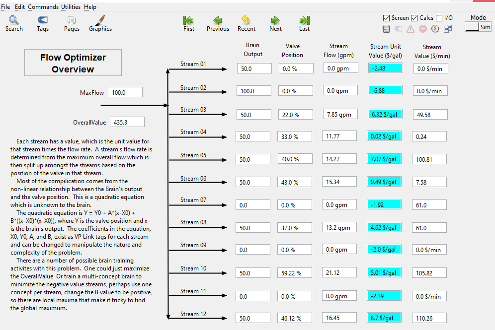
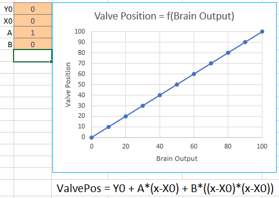
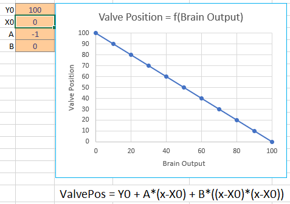
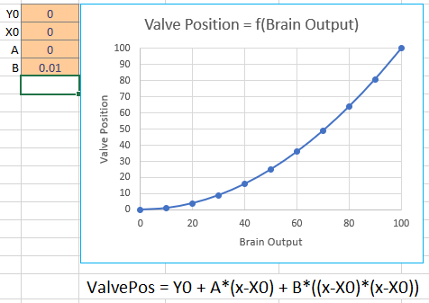
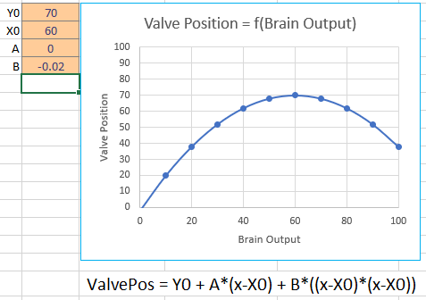
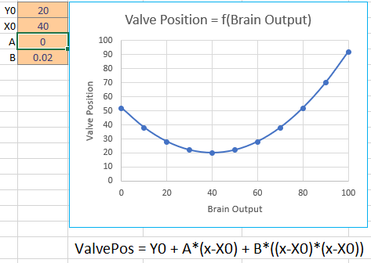
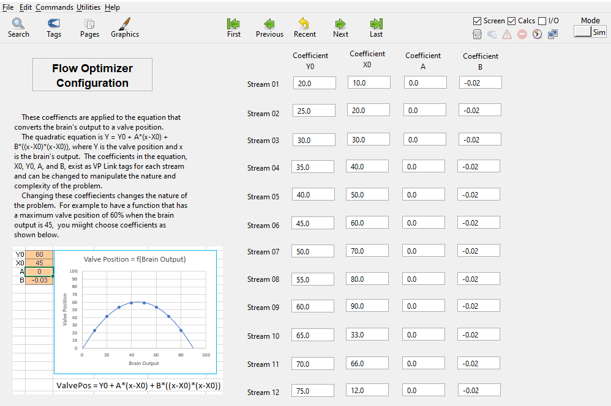
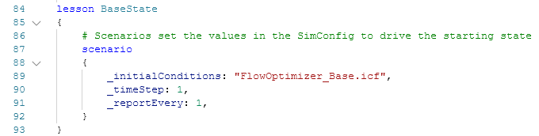

# Flow Optimizer VP Link model

The Flow Optimizer model presents a non-linear problem suitable for
studies of optimization.  The problem is designed to mimic a number of
optimization problems where a fixed amount of material is to be used or
subdivided optimally.  In this case, a certain flow rate is to
be split in up to 12 separate flow streams.  Each stream has a different
unit value, in terms of $/gal, associated with it.
The objective is to maximize
the overall value, which is the sum of each stream's flowrate times its unit value.

The process is illustrated below.  Your mission, should you choose
to accept it, is to build a brain
that manipulates the brain output tags (Action_01, Action_02, etc.)
in order to maximize the value of the OverallValue tag.
Use the supplied [VP Link loadable](FlowOptimizer_sim.zip) to create
your Bonsai Simulator.

## Process Description

Each stream indicated is controlled by a valve.  However the valves
simply manipulate the relative flow in that stream as
the overall flow is set by the MaxFlow tag.  So if only one of the 12
valves is open, all the flow will go through that valve.
Two valves equally open will enable the same flow rate to flow through
them.

The trick is that the brain does not control the valves directly.  There is
a function, unknown to the brain, that determines the valve
output as a function of the brain output.  While the function is unknown to
the brain, it is known (and defined) by the person setting
up the problem.  This is a quadratic equation defined as
ValvePos = Y0 + A * (x-X0) + B * ((x-X0) * (x-X0)).  "x" is the value of the
brain's action for that stream.  This 'x' is captured in an 'Action_nn' tag,
where nn represents the stream
number and varies from 01 to 12. The user defines the four
coefficients:

* Y0, is the value of the function when the brain input, x, equals X0.
This essentially shifts the curve vertically.
* X0, an offset to the brain output used to shift the curve horizontally.
* A, the linear term coefficient.
* B, the squared term coefficient.

These four coefficients exist for each of the 12 streams.  For example,
the coefficient tags for stream #1 are:
* Yzero_01, EU Range = (0 - 100)
* Xzero_01, EU_Range = (0 - 100)
* A_01, EU Range = (-10 - 10)
* B_01, EU Range = (-1.0 - 1.0)

The VP Link tags holding the coefficients for the other streams
simply change the last two digits to represent the stream number.

Some samples of the relationship you can build from the BrainOutput
to the valve position are shown below.

Simple linear relationship from brain output to valve position.

Inverted relationship between brain output and valve position.

Simple squared relationship.

Non-linear single maximum.

Non-linear multiple maxima.

The user can also set the unit value for each of the streams.
These are set by the 'UnitValue_nn' tags, where nn
is again the stream number from 01 to 12.  This unit value tag
is multiplied by the flow to get the stream's overall value.

## State Tags
* OverallValue -- The sum of the current values of all the streams.
This is the sum of each stream's flowrate times its unit value.

## Action Tags
* Action_01 -- Range (0-100), the output from the brain to affect the flow of stream #1
* Action_02-- Range (0-100), the output from the brain to affect the flow of stream #2
* ...more tags for other streams...
* Action_12 -- Range (0-100), the output from the brain to affect the flow of stream #12

## How to get started

If you just want to get started with the Flow Optimizer, create a
simulator from the [VP Link loadable](FlowOptimizer_sim.zip) and
use the included [FlowOptimization.ink](FlowOptimization.ink) file to train a brain.
To do this, open https://preview.bons.ai/ in the web browser and open your workspace.
To add the simulator, click the Add sim button located on the left
pane. Select VP Link as the process simulator, drag and drop the
FlowOptimization_sim.zip and type in the name to the simulator (check for duplicate names).
Click on Create simulator; a simulator to train the Bonsai brain will be created
in the workspace. Once the simulator is created, user needs to select the
simulator, click on Create Brain button and and type in the name of the brain
 (check for duplicate names). An untrained brain will be created. User needs
to copy paste the code from inkling file (FlowOptimization.ink), update the
simulator name in the inkling code and train the brain.

<!--
If you use the FlowOptimizer.ink inkling file, you may get results like this.  
-->

Once you get a trained brain, you might want to test that brain with other
values of the valve position function coefficients to see
how well it does at conditions other than what it was trained against.

### Using initial conditions files

You can use Initial Condition files (\*.ICF) to change the way this problem
is configured.  Each .ICF file is a text file that sets
the value of a configuration tag to a known value.   You can also add these
tags to the SimConfig data type if you want to set them
directly from Inkling.

The FlowOptimizer_Base.icf has the following values for the quadratic
function coefficients.  

Other ICF files are included to match the relationships shown above.
You can use any of the following ICF files to adjust the behavior of the model.
* Function_Linear.icf
* Function_Inverted.icf
* Function_SingleMax.icf

See the options that are available as \_initialConditions in the SimState.  The list
of available initial conditions is listed in the comment in the definition of the SimConfig.

You select one of the initial conditions files to set the type of function you want to use
as the transform between the brain output and the valve position.  This is done inside
an Inkling lesson.  This is what can make the problem easy or harder for the brain to solve.

## Further investigations

As this example is meant to be the basis of various investigations on how to train a brain, the following questions
come to mind.

*  Does the brain train faster when the function between the brain's Action and the valve position is linear?  If so, then that would
imply that some linearization of the state variables might be beneficial to training a brain.  Also, are there any bonsai features
that can help overcome the non-linearity of the response to the brain's actions?
*  How long does it take the brain to train when there are only three flows in the state?  How does this training time vary
as a function of how many total streams there are in the problem?
*  An obvious element of this optimization is to ensure that flows that have a negative value are minimized to zero.
Can you devise a way to tell the brain this simple mechanism so it does not waste time learning that behavior?
*  If the value of the B_nn tag is positive, then the quadratic function between brain output and
value position "faces up" and may have more than one maximum.
Does your brain design get stuck on a locally optimal value, or can you teach the brain to find the global optimim?
*  Does the brain learn any slower (or faster!) if the quadratic function between the brain output and the valve position
are the same type for each stream?  For example, does the brain learn slower if some of the valves are
linear and others are inverted vs. either
all linear or all inverted?
*  This problem is what automation folks would call a "steady-state" problem.  That is, given a set of inputs (i.e. brain actions),
the state (OverallValue) does not change with time.
While some problems can be reduced to steady-state problems, real world examples are often not this simple.  Look for
an update to this problem that introduces time variance.  You can then test one of your existing brains on the dynamic (i.e. not steady-state)
problem to investigate how those problems are solved differently.

## Further Resources

None, yet.  Wait for it.