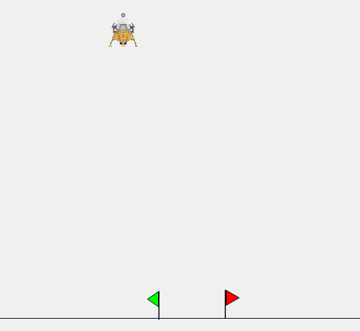

# Lunar Lander VP Link model

The Lunar Lander model presents the traditional 2D game as a simulation with VP Link.

The situation is illustrated below.  Your mission, should you choose
to accept it, is to build a brain
that manipulates the two lander engines, engine1 and engine2, to 
position the lander on the ground between the flags.
Use the supplied [VP Link loadable](lunarlander_sim.zip) to create
your Bonsai Simulator.

## Simulation Description

A lander starts 40 m above the surface.  The lander has two engines, 
engine1 and engine2.  Engine #1 provides vertical thrust and will 
allow the 100 kg lander to hover (in Earth gravity) when its output is 0.5.
The thrust from the lander is linear with the engine output.

The lander also has two horizontal engines to push it left and right.
To keep the controls simple, there is just a single output that controls 
these two engines.  This is known as a split-range controller in automation jargon.  
The output ranges from -1.0 (full thrust left) to +1.0
(full thrust right).  Zero output for engine #2 will result in no thrust to
the left or right by the horizontal engines.  Note that by using the split range
controller, the situation where the left and right engines are fighting each other
is avoided.  The split-range controller enforces the requirement that while one horizontal
engine is firing, the other is off.  In addition to avoiding wasting fuel, 
this also has the nice side effect of making
it easier to train the brain.

In a deviation from the original game, this lander does not have the ability to rotate.  The engines are aligned with
its center of gravity, and on-board gyroscopic stabilizers maintain its attitude.

The lander starts off hovering at some position.  The space between the flags is 4 m
and the lander itself is 2 m wide.  The flags are centered around the (x,y) coordinate
(0, 0).

## Inkling Features used

* Multi-concept
* Action Masking (coming)

## State Tags
* x_position -- (-50 .. 50) meters -- The horizontal position of the lander relative to the midpoint of the target flags.
* y_position -- (0 .. 100) meters -- The height above the surface.
* x_velocity -- (-100 .. 100) meters/sec -- The horizontal position of the lander relative to the midpoint of the target flags.
* y_velocity -- (-100 .. 100) meters/sec -- The height above the surface.

## Action Tags
* engine1 -- Range (0 .. 1), the output from the vertical engine
* engine2 -- Range (-1 .. 1), the output from the horizontal engine.  Negative values move the lander to the left.

## How to get started
If you just want to get started with the Lunar Lander, create a
simulator from the [VP Link loadable](lunarlander_sim.zip) and
use the included [lunarlander.ink](lunarlander.ink) file to train a brain.
To do this, open https://preview.bons.ai/ in the web browser and open your workspace.
To add the simulator, click the Add sim button located on the left
pane. Select VP Link as the process simulator, drag and drop the
lunarlander_sim.zip and type in the name to the simulator (check for duplicate names).
Click on Create simulator; a simulator to train the Bonsai brain will be created
in the workspace. Once the simulator is created, the user needs to select the
simulator, click on Create Brain button and and type in the name of the brain
 (check for duplicate names). An untrained brain will be created. User needs
to copy paste the code from inkling file (lunarlander.ink), update the
simulator name in the inkling code and train the brain.

> Note that while this example is called the Lunar lander, the gravity is actually 
set to that which we experience on Earth.

### Using initial conditions files

There is an Initial Condition file, StartingPoint.icf, that can reset the problem at 
the start of every episode.  You need to specify this file name as the value for the intialConditions of the 
scenario in your lessons.  The StartingPoint.icf puts the lander at 40 m above the surface, and 10 m to the 
left of the flags.  The lander is hovering in place with engine1 at 0.5, so the x_velocity and y_velocity are both zero.

## Modifying the VP Link Loadable

The VP Link loadable contains the information for a specific simulation
to run on the bonsai platform.  Inside the loadable, there is a ./cfg/ directory
which contains the VP Link model, and any initial conditions files needed to
reset the model to a starting point.  These initial conditions files
are simple text files with commands in them to set the values of various
VP Link simulation tags at the start of an episode.

You can unpack the sim.zip file, duplicate the existing .icf file to a new one,
and change the values in the file to set various simulation values to a different
starting state.  Simple rezip the contents (with the new file) and then you can
use the new file name in the initialConditions: value of the scenario.
It is also possible to specify multiple initial conditions files.  In that case, they 
will be applied in order.

## Further investigations

As this example is meant to be the basis of various investigations on how to train a brain, the following questions
come to mind.

*  How effective is the brain training in a single-concept vs. multi-concept architecture?
*  Can you architect a reward function that works as good as or better than the Goals?
*  Can a brain that is trained to work in Earth gravity also effectively land the lander
with Moon gravity?  This is a common question that relates to the sim-to-real gap.

## Further Resources

None, yet.  Wait for it...