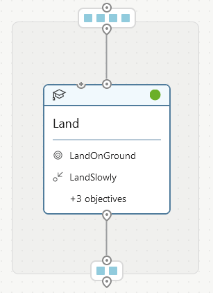

# Lunar Lander VP Link model, Chapter 1

If you are here, you should have completed the [instructions](../README.md) in the documentation
in the root directory of this sample.

That means you have a SIM called "lunarlander", and are ready to create a brain.

## Let's start with a simple brain

If you have not created a brain yet, go to the bonsain main page and create an empty brain.
Call it {your_initials}\_LunarLander.  This way, you can keep your brains separate from others
that may also be using your bonsai workspace.

Copy the [lunarlander_ch1.ink](lunarlander_ch1.ink) code and paste it into your brain.
Before we train the brain, let's take a look at what we have.  You should see the following 
in the right hand side of your bonsai workspace.

## Inkling Discussion

The following paragraphs discuss the content of the Inkling file.

### The SimState
Lines 12-22 define the SimState. This is the structure that the SIM will pass back
to bonsai in reponse to the SimActions that bonsai calculates.  This SimState is
determined by the SIM, and is described in the interface.json in the sim.zip file.

### The SimAction
Lines 26-31 define the SimAction. This is the structure that bonsai is responsible
for calculating.  The SimAction is transmitted to the SIM, which then calculates a
SimState for bonsai.  Round and round the SimAction and SimState go until the 
brain is trained.

### The SimConfig
Lines 35-52 define the SimConfig. This is the structure that is sent to the SIM
at the start of each training episode.  The values of the SimConfig are set by
lesson/scenario sections in your Inkling code.  Members of the SimConfig that
do not start with an underscore are assumed to be VP Link tags.  This allows
you to directly set the value of _any_ VP Link tag at the start of an episode.
You can add additional tags into the SimConfig at will.  By default, all 
the tags in the SimState are replicated in the SimConfig, but this is just a
convention of the BonsaiSimCreator tool, not a requirement.  You can add additional
tags into the SimConfig so you can set them in lesson/scenarios later in your
Inkling code.

### Constants
Lines 54-61 define usefully-named constants so we do not need to put "magic" numbers
throughout the code.  While is seems easier to just put in a value of 0.1 for the
VP Link time step, anybody who reads your code one month from now (including you)
will appreciate the use of named constants instead of bare numbers.  Just do it.

### Simulator
Lines 64-67 define the simulator to use to train this brain.  If you did not call
your SIM "lunarlander", this is the place to change the package to match your SIM
name.

### Concepts
The "Land" concept starts at line 74.  As we just have a single concept in this
brain, we use "input" as the input parameter, and SimAction as the type of value
that is generated by this concept.   Because there is only a single concept in this
brain design, the "output" keyword is not required on the concept definition.
 The curriculum object 
defines the Trainig, the Goals, and the Lessons.

#### Curriculum Training
Lines 75-83 show three parameters of the training have been set.  The EpisodeIterationLimit places a maximium
value on how long a training episode will take.  In this case, we use an expression to 
calculate the number of training iterations to use as the maximum.  To do this, figure out how long 
(in seconds) bonsai _should_ take to solve the problem. Then divide by the number of seconds/iteration
the SIM will do.  If you specify a time that is too short, bonsai won't get a chance to 
solve the problem fully.  If you specify a time that is too long, then you will likely waste 
training iterations because either 
  a) bonsai has gone off into the weeds and is not learning anything, or 
  b) bonsai has already learned what to do and is just continuing to do it.

Generally, you want to force bonsai to get to the solution as quickly as possible, so that's 
another reason not to make the EpisodeIterationLimit too long.  Otherwise bonsai might lazily
find the solution.  We will see this later in this example.

The TotalIterationLimit prevents the entire training from consuming the world's compute 
power.  It places a limit on the number of iterations to do before completely giving up.
This is typically a number like 20-50 million.

The NoProgressIterationLimit defines when bonsai decides that the training for a
particular Lesson is done.  If this is too small, then bonsai might decide that the
training for that lesson is complete because there has been no progress in X iterations,
even though the overall progress towards success is still way less than 100%. In this 
case, the training would be stopped prematurely before other alternatives were explored
by bonsai.  If the limit is too long, then once bonsai gets very close to the 100% success
rate, it will still try for that many iterations to try to improve the result.  Numbers
from 200k to 1 million are common.

#### Curriculum Goals
Lines 88-100 are the most important thing that you as "the human" can specify.
These are what determines if bonsai is doing a good job or not.  In this case we have
set out the following goals.

* LandOnGround:  We want the lander to reach the ground.  Once it does, the training
session is over.  The "reach" statement will stop the training once this occurs. Note
that the Goal.RangeBelow(0.0) includes the value of zero in the range.  So once the
lander is on the ground, we are done.

* LandSlowly:  This is something we want the brain to do all the time, so we use a 
"drive" statement. In this case we want the brain to keep the descent rate (y_velocity)
between -0.5 and 0.0.

* WithinFlags:  We want the brain to keep the lander between the flags, so the x_position
is between -2.0 and 2.0 meters.  (The target landing point is at x=0, y=0).

* FlyingIntoSpace:  We want to avoid this, so naturally we use the "avoid" statement.
This tells bonsai it has done a bad thing.  In addition, the training episode is terminated,
so bonsai does not spend more time doing more bad things.  Avoid statements are 
very important to limit wasted training time.  Otherwise it is very likely the brain
would continue the training in some region of the SimState we do not care about.   In this
case, there is really no benefit to learn to go up to 50m above the flags.  

* HardLanding: This tells bonsai to avoid a situation which is bounded by more than one
variable.  In this case, getting inside the "box" of being very close to landing and 
with a large downward velocity is bad.  Either one of these conditions is ok by itself,
but the combination is bad.

#### Curriculum Lessons
Lessons give the brain some guidance on how to train itself.  Imagine you are learning 
to swim.  Jumping off a boat into the ocean may not be the ideal way to start.  You 
might start by wading into the shallow end of a pool and learning how to float.  Lessons
do this for a brain.  They set a set of parameters that the brain will use while it is 
training.  Lessons are tackled in order.  Once a lesson has been mastered, the brain 
will automatically move to the next lesson.  Once all the lessons have been learned,
the concept is deemed "trained".

The lesson on lines 101-110 sets some or all of the values that are defined in the SimConfig.  In the case
of VP Link, every SimConfig has the values that start with the underscore.  Other variables
in the SimConfig that do not start with an underscore are VP Link tags which bonsai
is to set at the start of an episode.

The \_initialConditions variable resets the VP Link SIM to some known condition at the start
of every episode.  These "Initial Condition Files" or .icf files are included in the SIM
and enumerated in the description of the \_initialConditions variable in the definition of the
SimState.

The \_timeStep is the length of time of a VP Link simulation time step.  This is set based
on the underlying math of the model and is low enough to prevent the model from going unstable.

The \_reportEvery variable is the length of simulation time that should elapse before VP Link
returns a SimState to bonsai.  Normally, you would think that this is the same value as the
VP Link \_timeStep, but that is not necessarily the case.  Generally if you want bonsai to 
take quick actions to keep a process controlled, this would be a small number.  But if you
want bonsai to learn the big picture, and do some opitimization over the course of hours, 
this variable could be larger.

Note that this variable defines the length of simulation time that is consumed in one bonsai 
iteration.  So every time we talk about iteration limits, etc., that translates to this
amount of simulation time.  Hopefully the SIM can run much faster than the wall clock, so
that hours of simulation time may only take minutes of time for the wall clock.

Other variables are just the values for various VP Link tags which are set at the start of an
episode.

## Give it a try

Click on the concept to be trained (there is only one, I know), and then click the green train button to start the training.

You will find this sample takes a very, very long time to train. It might not even train
at all before it reaches one of the training limits.  That's ok, it's why we have Chapter 2.
In Chapter 2, you will learn how to help the brain learn.

Below is one training run for this brain.  You can see that the goal satisfaction did not
reach 100% after 1.2M iterations.  This brain would likely need to be trained for a much longer
time before one of its explorations found a good route to pursue.

## Further investigations

This was a simple brain just to get us going with brain training.  You might want to 
explore some of these questions on your own.

* How many more iterations are necessary for the brain to get the Goal Satisfaction up to
(or very close to) 100%?
* Can you come up with better Goals for the Land concept?
