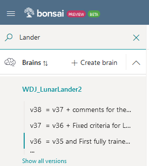
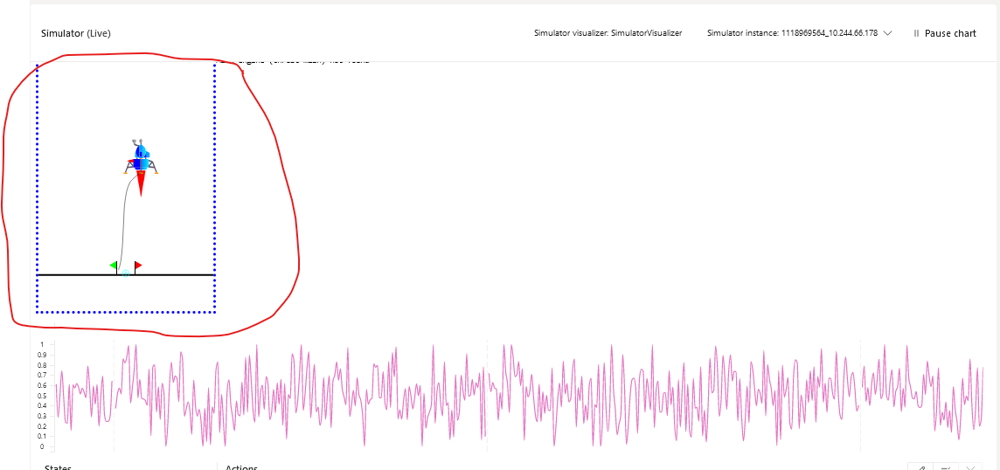
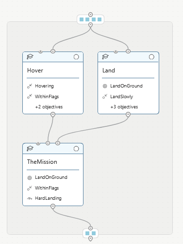
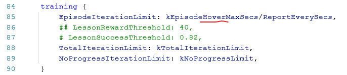
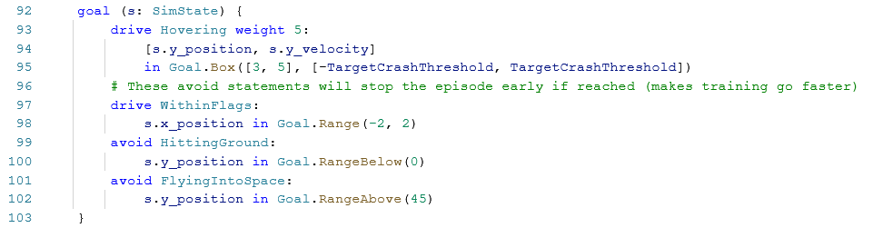
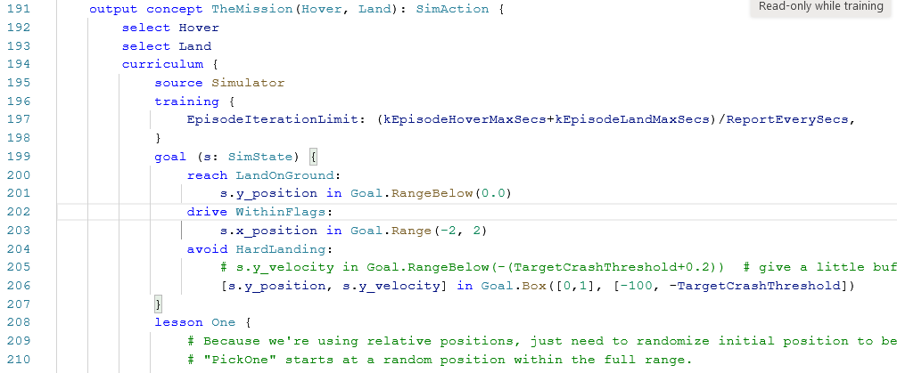

# Lunar Lander VP Link model, Chapter 2

If you are here, you should have completed the [instructions](../chapter_1/README.md) in the documentation
in Chapter 1 of this sample.

That means you have a SIM called "lunarlander", and you have a grammatically correct
Inkling file that may or may not have actually trained.

To use this chapter's Inkling, you will want to make a new brain version first--
that way you can keep both the prior chapter's file and this one in the same brain.
Right click the latest version of the brain you are using in the left hand pane
of your bonsai web page, and choose "Copy Version".  This will create a new
version of the brain.  You can grab the Inkling from this chapter's repository,
and paste
it into the brain, completely overwriting the copied Inkling code.

As a litte trick, I like to adjust the first line of the notes to say: 

  ```= v01 + comments for the new features I added```
  
That way in my list of brains, I can see that vXX = vYY + other features.



## Additional Features we add in this Chapter

In this Chapter, we will add the following functionality to help get the brain
trained.

* A Visualizer
* Split the brain into multiple concepts
* Use a selector concept to pick the best action to complete the mission.

## Inkling Discussion

The SimState, SimAction, and SimConfig remain the same from the previous example.
Below is a description of the changed items.

### The Visualizer
Line 12 defines the Visualizer.  

The Visualizer is a web site that the bonsai 
platform will contact and send the SimState, SimAction and SimConfig information
via a POST request.  We will skip the details in this discussion, but you can
find more information about creating a bonsai visualizer
[here](https://learn.microsoft.com/en-us/bonsai/tutorials/visualizer-plugin).

The visualizer shows up just above the live plots when a brain is training or when
you are looking at Custom Assessment data.  In the case of the Lunar Lander a trail
indicates where the lander has been during the episode.

### Concepts

If you think about how you might want to operate the lander, you might have two 
distint skills you with to employ.
* The first is a skill that allows you to get
the lander to the right spot (i.e. in between the flags) at some small distance
above the surface.  
* The second skill is to be able to descend slowly so you can touch the ground 
without crashing the lander.

If you can think of distinct skills you might need to perform a task, then you 
have a case for a multi-concept brain.  Multi-concept brains are an important
part of your bonsai arsenal, because generally, they are easier to train.  
Imagine your lander has a place for two people to control it.  One person 
could learn to hover the lander over spot.  The other person could learn to 
land the lander once it is hovering.  In each case, the lander operators would
have to learn only a subset of what is takes for a successful mission.  

We would also need a captain to decide when each person is controlling the lander.
Obviously we want the person trained in landing to do the final landing.

This is very much the way we will set up this brain training.  Instead of 
people with certain skills, we have concepts.  And we also have a selector 
which acts as the captain, deciding whose turn it is at the controls.  Such a
brain design ends up looking like this.



#### Hover Concept
Lines 79-132 show the new concept we have added to this brain design.  You
can start by copying the Land concept from the previous chapter's brain
and pasting it into the graph object
just above the Land concept.  This will duplicate the concept (which bonsai
will complain about), but you can easily fix that by changing the name of the
new concept to Hover

The curriculum/training objet for the Hover concept is just like the Land
concept except that the EpisodeIterationLimit on line 85 uses the constant,
kEpisodeHoverMaxSecs, instead of the kEpisodeLandMaxSecs.  This is because
we might need a little more time to hover the vehicle since it is coming from
far away.  


The big change in the Hover concept are the new goals. We no longer need
the LandOnGround skill, so that is removed as a goal.  Similarly, we do
not need to LandSlowly, so that goal is removed as well.  What we do need to learn
however, is to Hover.  So the new goal is called Hovering, and it tries to 
maintain (therefore we use the "drive" statement) the y-position between
3 and 5 meters, along with a y-velocity that is close to zero--in this case 
between -TargetCrashThreshold and +TargetCrashThreshold.  


And just to make sure we do not waste time training on things that we do not
need to learn, we have two avoid statements.  Hitting the ground is a bad
thing while hovering, so lines 99-100 take care of that.  Also if you are
trying to hover between 3 and 5 meters, and you find yourself at 45 meters
off the ground (as we will see later, that is higher than you started), you
might as well give up as well.  The "avoid FlyingIntoSpace" goal takes care
of that.

> Note, while doing actual training, you will likely see that many episodes
are cut short because the craft was "flying into space".  That shows the 
goal to avoid that is working!

#### Hover Lessons

There are also some changes in the Hover concept lessons that make it 
easier to train.  In this case, if you want to hover between 3 and 5 meters,
it might be easier to hover there if you are already there.  So in this case
we have a lesson called "StartNear4m" that will constrain the starting point
to between 2 and 7 meters from the ground.  After that, on lines 113-120, there
is a lesson that starts the lander from between 2 and 10 m off the ground.
Then, finally, we have the last lesson which starts between 1 and 40 m off the
ground.

Do not forget to put a limit on the x-position as well. Otherwise bonsai will
choose a value betwween the limits that are set out in the SimState.  In our case,
that would be much father out than the limits of the visualizer.  So, for now,
we limit the values of the x-position and y-position to what the visualizer can 
show.

#### Land Concept

In this case, we left the Land concept alone.  You might want to try
adding a set of lessons that allows the brain to progress in its training
to see if the total number of iterations needed to train is increased or
decreased.  It is likely that the toal number of training episodes needed
to actually do good training is reduced, but because the 
NoProgressIterationLimit will need to expire **for each lesson**, the overall
training iterations may increase.
 
## Bringing the two concepts together

The last thing we need to add is the "Captain".  This is a learned concept
that decides which of the other two concepts to use.  


Line 191 has some significant changes.  First, as we have three concepts
in this brain, one of them needs to be designated as the one which outputs
the SimAction to the SIM.  This is done with the "output" keyword.  Second,
as this concept needs to use the other two concepts as inputs, the parameters
to the concept include both of the other two concepts, Hover and Land.

Lines 192-193 are also significant here.  Because we want this concept to
only select between the other two concepts, we add the "select" keywords
to tell bonsai it can pick from one or the other input concepts.  Without
these "select" statments bonsai would try to modify the outputs, just like the
other two concepts did.

Line 197 is changed so that this concept has enough time (or iterations) to 
complete both actions so the EpisodeIterationLimit includes tims for both of
those concepts.

Line 199-207 has the goals.  Note that here, we only put the final mission
goals.  Since this is just a selector we should not have to care about
flying into space, becuase the other concepts were both trained not to do that.
It is also possible that the "avoid HardLanding" goal may be superflous. 
That's a good question for further research.

## Give it a try

With a multi-concept brain, you will need to train each concept individually.
In addtion you need to train the preceeding concepts before subsequent ones
can be trained.
As before, click on the concept to be trained, and then click the green train
button to start the training.

With any luck you will find that the individual concepts do not take as long
to train as the monolithic concept we created in the first Chapter.

Still want to learn more about bonsai features?  Try [Chapter 3](../chapter_3).

## Further investigations

Here are some things you can try on your own that were discussed in the text above.

*  Is the "avoid HardLanding" goal in TheMission select concept superfluous?
*  How does the value for the NoProgressLimit affect the length of brain training
when there is more than one lesson to be learned?

