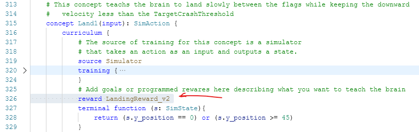
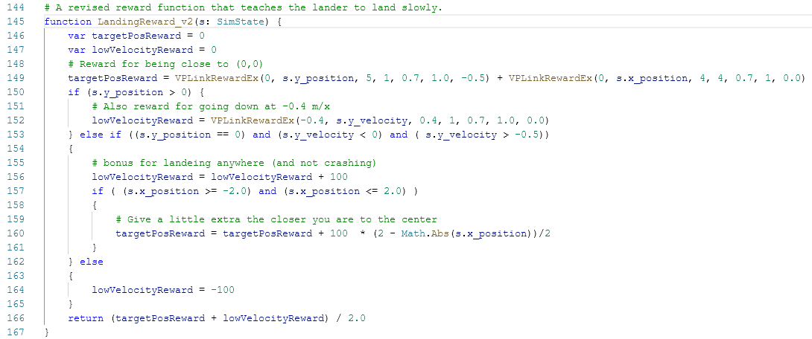
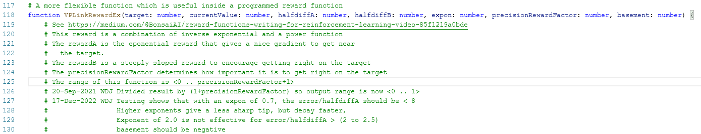
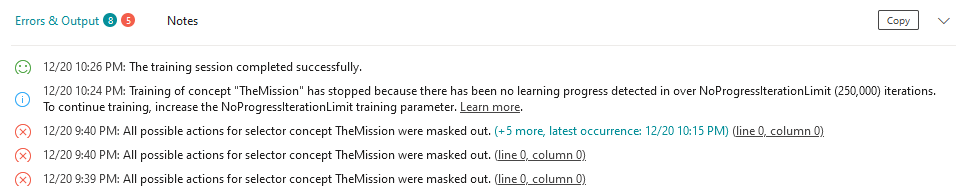

# Lunar Lander VP Link model, Chapter 3

If you are here, you should have completed the [instructions](../chapter_2/README.md) in the documentation
in Chapter 2 of this sample.

That means you have a SIM called "lunarlander" with a few versions already
and you have a grammatically correct
Inkling file that may or may not have actually trained.

Since this originally was the last chapter, the files for this chapter are in the root
directory for this sample.  Use the lunarlander_sim.zip and lunarlander.ink from 
[the linked directory](../)

To use this chapter's Inkling, you will want to make a new brain version first--
that way you can keep both the prior chapter's file and this one in the same brain.
Right click the latest version of the brain you are using in the left hand pane
of your bonsai web page, and choose "Copy Version".  This will create a new
version of the brain.  You can grab the Inkling from this chapter's repository,
and paste
it into the brain, completely overwriting the copied Inkling code.

## Additional Features we add in this Chapter

In this Chapter, we will add the following functionality to help get the brain
trained.

* Use the State Reduction pattern to reduce the size of the state each concept needs to deal with.
* Use a programmed (rather than a learned) concept to choose actions from different concepts when the
selection criteria are obvious to humans.
* Add action-masking to help the selector concept do its job.
* Change the Land concept to use a programmed reward rather than Goals.

## Inkling Discussion

The SimState, SimAction, and SimConfig remain the same from the previous example.
Below is a description of the changed items.

### State Reduction

State Reduction is a powerful tool, especially when problems get large.  This is
where your conversation with the SME will bear fruit.

The general idea is to minimize the number of SimState variables that bonsai
has to try to correlate.  This "state space" grows very quickly as the number
of State variables increases, so knowinng how to reduce that is a good thing.

The first thing you need to know is what variables in the SimState are correlated
with the variables in the SimAction.  If all the variables in the SimState
are needed to figure out all the variables in the SimAction, then you are in
for a long slog through the training.  However, if you can find SimAction variables
that only need a subset of the SimState variables, then you can apply this 
technique. 

In the case of the lunar lander, the thrust from the main (vertical) engine
only depends on the y-position and y-velocity.  Since the main engine does
not affect the x-position or the x-velocity at all, those two horizontal 
variables can be removed from the calculation of the vertical engine.  And
since the Hover concept does not manipulate the horizontal engine at all, 
we can change up the Hover concept so that its input only has the vertical
SimState variables and it only outputs the main engine output value.  This
simplifies the underlying formulation of the brain and therefore makes the
training easier.  Think of it like this; the brain does not have to spend
time figuring out that it does not care about the horizontal components of
the SimState.

To do this, we need some new structures.  We will make two, smaller "SimState"s
--one with only the vertical and one with only the horizontal components in them.
Lines 67-75 define two new States we will use, the XSubState and the YSubState.
You can see that each of them only has the variables needed in one of the
directions.

In addition, since we will have two concepts that output different actions, 
we need to define those Actions.  Lines 77-85 define the two action, Engine1Action
and Engine2Action which will be the new outputs from the Hover and GetWithinFlags
concepts as they work with the two reduced states, YSubState and XSubState.

Before we can train the new Hover and GetWithFlags concepts, we need to get
data into the reduced state.   Concepts are the building blocks of a brain
and they take inputs and produce outputs.  So it is only natural we will
use a Concept to reduce the size of the state.  But rather than train
a concept we can simply program it for a simple task like this.  Look at
lines 259-261.  This defines a concept with an input and an output like
we have seen before.  But instead of a curriculum with goals and such
we simply define a programmed function which will tranform the input to the 
output.  

Lines 98-103 show the simple programmed function that is used by the 
StateForMainEngine concept.  The function simply copies the values
from the SimState into the corresponding variables in the YSubState structure.
Similarly, the ReduceStateForHorizontalEngine function (lines 89-94) 
generates a reduced
state for the StateForHorizontalEngine on lines 255-257

### Changing the concepts to use a reduced state

The changes to the Hover concept are minimal and we only need to change the 
input and output defintions on line 264.  You see we change the input
parameter to the name of the concept that precedes it--i.e. StateForMainEngine.
The output type of the concept is modified as well--we now use the reduced
output, called Engine1Action as the output type of the concept.

The same type of changes are done to the GetWithinFlags concept.  Its
input is now the StateForHorizontalEngine concept, and its output type
is Engine2Action.  

### Programmed Action Amalgamation

Because separate concepts determined the values for each of the lander's
engines, they need to be combined back into the full SimState before
going to TheMission selector concept.

This is a job for another programmed concept, CombinedEngineThrust.  
As before, we enter the 
preceding concepts as the inputs to this concept and specify the output
type--in this case the full SimState again.  The programmed function,
CombineEngines, is on lines 106-111.  It simply returns a structure
that takes the engine1 parameter from the Engine1Action and the engine2
parameter from the Engine2Action.

### Action Masking

We (the humans) can help TheMission selector concept by giving it hints
(actually "enforced suggestions") as to when to use each of the inputs
it can choose from.  These hints are so strong, it can make a learned
concept train very quickly. I like to think of it as a quasi-programmed
concept.  

These hints that are given to the selector concept are called "action masks".
The idea is that you can tell bonsai when certain action are **disallowed**.

Lines 431-436 define the action mask for the selection of the 
CombinedEngineThrust concept.  We want to select this concept under a 
certain set of conditions.  Note that it seems much more natural to 
calculate when the action **should** be used and store that in the "enabled"
variable.  The return value from the action mask is then always (enabled == false).

Note the parameter to the mask function should define a variable that is the
same type as the input to brain. 

See additional details at the [action mask documentation](https://learn.microsoft.com/en-us/bonsai/cookbook/inkling/mask-selector-options)

### Programmed Rewards

When the best thing to do is easily described with a mathematical function,
programmed rewards give you an option to tune the brain's performance.

This brain uses a reward function.  Lin 326 uses the reward keyword in the 
inkling file in the curriculum section.
The reward is defined as a function elsewhere in t

The reward function, LandingReward_v2 is defined on lines 145-167 as below.

The astute observer will notice that this fuction makes use of another function,
VPLinkRewardEx().  This is a generalized reward function that rewards the brain
for getting a variable close to a target.  There are actually two rewards internal
to the VPLinkRewardEx().  The documentation for the function is reproduced below.

## Give it a try

Use the inkling found [here](../lunarlander.ink) to try out all the features mentioned in this chapter.

## Further investigations

Here are some things you can try on your own.

* Does all this effort to make more focused bonsai concepts really either reduce the 
training time or make a better brain.  How would you compare the brain trained in
Chapter 1 vs. the brain trained as a result of using all these features.  How might
your answer change if faced with a different problem, let's say one with a larger 
state space?
* Why do these errors come up while the brain is training?  And what operational
impact do they have?

* How would you eliminate those errors?
* Take a look at the documentation for Chapter 4.  Chapter 4 takes you on a journey 
to make some changes that take advantage of
additional features of this VP Link based SIM.  
