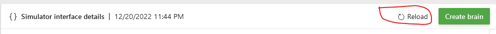

# Lunar Lander VP Link model, Chapter 4

If you are here, you should have completed the [instructions](../chapter_3/README.md) in the documentation
in Chapter 3 of this sample.

That means you have a SIM called "lunarlander" with a few versions already
and you have a grammatically correct
Inkling file that may or may not have actually trained.

This chapter will highlight some more features of the VP Link based SIM, and 
provide some ideas for further exploration of the bonsai platform.  There is not
a single "answer inkling file" for this chapter, but you will find some code
snippets to insert in your own LunarLander brain.

## Additional Features we add in this Chapter

In this Chapter, we will look at the following.

* Building the default SimState, SimConfig, and SimAction structures.
* What happens if there is a disturbance in the forces on the Lander.
* How can we adjust the brain to minimize the fuel that is used by the Lander.

### The default SimState

You might have noticed that the bonsai web interface will create the SimState, 
SimAction and SimConfig for you.  Just go to the lunarlander SIM in your workspace,
and click on the button to refresh the default inkling code.

You will see that the default SimConfig actually has two more variables that we
have not been using.  There is a "fuel" and a "wind" variable.  Until now, we
have be only using a subset of the SimState that the SIM can provide.

## Using the fuel
Values in the VP Link SIM have a "Mode".  The Mode can be either Automatic or 
Manual.  When in Manual, VP Link tags are not calculated.  This is the default
state of the fuel.  It has a calculation defined, but that calculation is turned
off, so that the lander will never run out of fuel (at least up to now).  

You can turn on the fuel calculations in the SIM by putting the fuel tag into 
Automatic.  That is exactly what the "EnableFuel.sce" scenario file does.  It 
enables the calculation of the fuel (starts at 100kg and is reduced as the
two engines burn the fuel) duing the episode.  At the start of each episode,
the fuel is reset to 100 kg.  To turn on the fuel calculations for a lesson,
change the \_scenarios member to the string, "EnableFuel.sce".

### Exercise #1:
* Add the "fuel" to the SimState, enable it in a lesson, and use it in a 
reward function or Goals to try to 
minimize the fuel that the lander uses.

## Using the wind as an example of the Sim-to-Real gap

The idea that wind can blow the lunar lander either left or right 
is an example of a "Sim-to-Real" gap.  That is, the brain was trained
using a SimState that did not know anything about the wind.  And,
in fact, the "wind" in the SIM that the brain trained on was set
to zero.

However, in the real world, there might be wind.  And in that case
the brain will have to deal with the fact that it might be blown off
course when it actually tries to land the lander.  In this situation, the brain 
will be deployed in the real case where there might be wind, but it 
was not trained using any lessons where there was wind--this is an
example of a the "Sim-to-Real" gap.

As mentioned, while none of the training lessons incorporated wind,
the model does have the ability to simulate wind.  To test this Sim-to-Real
gap, we therefore trained the model with zero wind, but we _assess_ it with
added wind. 

There is a simulation tag called, "wind".  You can set the wind velocity
in the SimConfig _without_ adding it to the SimState.  This is the mechanism to
investigate the effects of a Sim-to-Real gap.

Wind is a horizontal wind that 
you can adjust.  Positive blows to the right, and negative blows 
to the left.  As the comment says, the force on the lander from the wind changes
as the square of the speed.  The wind velocity is limited to -10 to +10 m/s.

You can add the "wind" as a variable in the SimConfig.  That way, you can set it
in a lesson.  The "wind" variable is not calculated by the SIM--it is just a value that
you set.  So there is no need to change its mode.

### Exercise #2:
* Add the "Wind" to the SimConfig, and run an assessment.  Start with a value
of 2.0.  Can the brain that was trained without knowing about wind still land the lander
if the wind now tries to blow the lander off course?  Start with a value for the 
wind velocity between 1 and 3 m/s.  
* How much wind can the lander deal with?

If you wanted to teach the brain about wind, then you would have to add it to your SimState
so the brain knows how much wind there is.  You will also need to add it to your SimConfig
so you can set the wind in the scenario inside a lesson object.  

### Exercise #3:
* Add the Wind to your SimState and SimConfig, set the value in a lesson, and teach a revised brain 
to land the lander under various wind conditions.  Then use the same assessment you 
set up in Exercise #2 to test how well this brain works.

