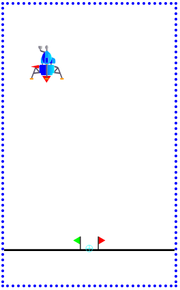

# Bonsai "LunarLander" Visualizer Example

## Intro

The following is an example visualizer for use with the "LunarLander" brain.

The visualizer is made up of a simple .html page and an SVG document.  It is also possible to embed the 
SVG inside the .html document, and in some respects that might be easier.

To use the visualizer, you need to host this directory somewhere on a site, and then 
put a link to that site in your inkling code at the 'root' level, outside of all braces.

~~~
const SimulatorVisualizer = "https://intelligent-ops.com/bonsai/visualizations/lunarlander/index.html"
~~~

Note that as of Aug 2022, the bonasi Visual editor allows you to set different URLs for different 
visualizers.

If you have npm installed you can host this page locally with

~~~
npm install -g http-server
npx http-server -p 8081
~~~

