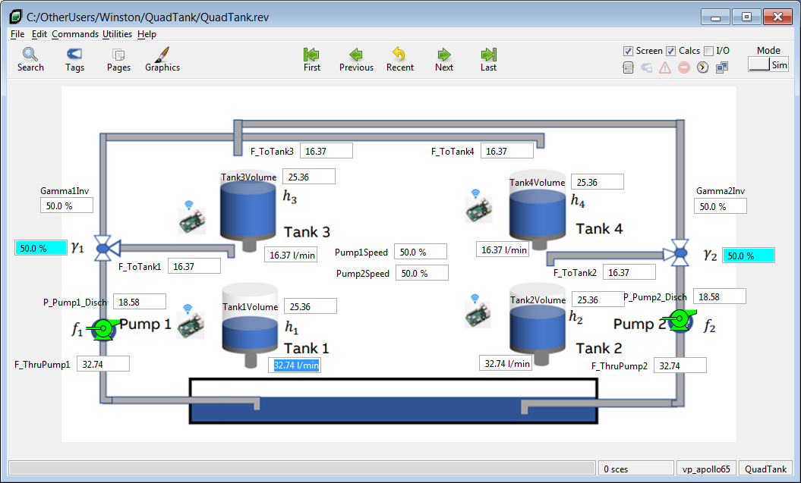
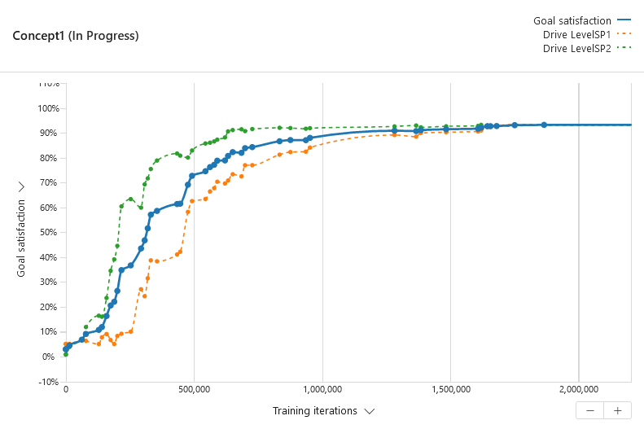

# Quad Tank VP Link model

The Quad Tank model demonstrates a more complicated control problem than the Simple Tank.  In this case, there
are two tanks where the level is being controlled, each by a pump that supplies liquid to it.  However, the two level controllers
interact with each other because some of fluid pumped by each pump flows to the other tank.  The flow going to the other tank is
further delayed in time by passing through the third and fourth tanks. The amount of flow that interacts with
the other loop is set by the parameters Gamma1 and Gamma2 (one for each loop).

There has been quite a bit of work done related to control theory about this problem.  While the setup of these tanks
is not meant to mimic a real-world process, there is some interesting
math that happens for various values of Gamma1 and Gamma2 that make this problem characteristic of some real world problems
and very worthy of an acedemic exercise.

The process is illustrated below.  Your mission, should you choose to accept it, is to build a brain
that controls the level in the two tanks to their setpoints for various level setpoints and values of Gamma1 and Gamma2.
Use the supplied [VP Link loadable](quadtank_sim.zip) to create your Bonsai Simulator.
Read the supplied [process description](QuadTankExplanation.pdf) for more information about how the process works and how this model was built with VP Link.

Hint: You might not want to train the brain to cover the entire state space at once.

## State Tags
* Tank1Volume[2] -- cm3 of fluid in Tank #1. This is an array with \[0\] being the current value and \[1\] the value from the previous time step.
* Tank2Volume[2] -- cm3 of fluid in Tank #2. This is an array with \[0\] being the current value and \[1\] the value from the previous time step.
* Tank3Volume -- cm3 of fluid in Tank #3.
* Tank4Volume -- cm3 of fluid in Tank #4.
* Tank1_SP -- Target setpoint for level in Tank #1. Units are in percent!
* Tank2_SP -- Target setpoint for level in Tank #2. Units are in percent!
* GammaSum: -- Sum of the Gamma tags.
* Gamma1 -- % of flow that goes from Pump #1 to Tank #1.
* Gamma2 -- % of flow that goes from Pump #2 to Tank #2.

## Action Tags
* Pump1Speed -- designed to control the flow to Tank 1 (with high values of Gamma1), units are % of maximum speed.
* Pump2Speed -- designed to control the flow to Tank 2 (with high values of Gamma2), units are % of maximum speed.

## How to get started

If you just want to get started with the Quad Tank, create a simulator from the quadtank_sim.zip and use the included QuadTankSimple.ink file to
train a brain.  This example is a simple brain design (one concept) and will train a brain to handle the case where Gamma1 = Gamma2 = 75%.

If you use the QuadTankSimple.ink inkling file, you may get results like this.  

Once you get a trained brain, you might want to test that brain with other Gamma values to see how well it does at conditions other than
what it was trained against.

### Using initial conditions files

Note in the QuadTank examples, the SimState includes three tags that are related to the Gamma values.  Gamma1 and Gamma2 control the percent
of the flow that goes from a pump to its corresponding tank.  You can change the value of these tags at the start of an episode by using the Gamma1
and Gamma2 members of the SimConfig structure.

There is also a GammaSum tag.  This is the sum of the Gamma1 and Gamma2 tags.  Obviously the SimState is now over-specified--if you have the Gamma1 and
the Gamma2 tags, you do not need the GammaSum.  However, because of the math involved, it is useful to specify the sum of the Gamma values along with
one of the values.  This keeps the brain from exploring sections of the state space that should not be combined in a single lesson.

The two \_initialConditions that are supplied are "QuadTank\_v4.icf" and "QuadTank\_v5.icf" \(see the comment in the SimConfig structure\).
These two strings are the name of a VP Link initial conditions file which was supplied in the loadable,
and is used to set the values of a set of tags.  It is a simple text file, but unlike the rest of the members of the SimConfig, you can also set
the VP Link mode (Auto or Manual) of the tag from the .icf file.  The QuadTank\_v4.icf sets up the simulation to use the Gamma1 and Gamma2 from the SimConfig, and
the QuadTank\_v5.icf sets up the simulation to use the GammaSum and the Gamma1 members of the SimConfig.

## A more complex brain

The QuadTankComplex.ink file has a more complicated brain design. It include the following elements:
*  A multi-concept brain that learns under two very different conditions.
*  A programmed input function to simplify the observable state used as the input to each concept.
*  An output selector function which selects the action from the proper concept based on the state.
*  The brain training is split up to train the brain incrementally with increasingly broad sections of the state space.
*  Two different reward functions which are not used, but can be easily switched into the brain design with just a few statements.

## Further Resources

See the following for other articles on the Quad Tank problem:
* 
* 
* 

