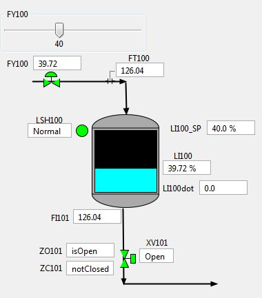

# Simple Tank VP Link model

The Simple tank model demonstrates the basics of a level control loop with Bonsai.  While Bonsai is often used to provide
setpoint guidance in a real-world deployment, this example assumes that Bonsai will be doing the direct control of the
final element.  A coming example will show how Bonsai can work with an existing controller to improve or modify its
performance over a range of target control philosophies.

The process is illustrated below.  Your mission, should you choose to accept it, is to build a brain
that controls the two Action tags in order to bring the level as measured in LI100 close to the setpoint as given in LI100_SP for
any given setpoint between 5% and 95% without overflowing the tank or letting it get empty.
Use the supplied [VP Link loadable](simpletank_sim.zip) to create your Bonsai Simulator.
Read the supplied [process description](SimpleTankExplanation.pdf) for more information about how the process works.

## State Tags
* LI100 -- the level in the tank
* LI100_SP -- the target level setpoint

## Action Tags
* FY100 -- controls the inlet flow to the tank
* XV101 -- a block valve at the exit of the tank

## Further investigation

Once you have your brain trained, perform an assessment.  Do you see any difference in how the Bonsai brain controls the valves
vs. how a PID controller might do it?  If you are a VP Link user, put the XV101 valve in manual during the assessment.  This
will remove the ability of Bonsai to control it.  How does the brain perform when it has the proverbial "arm tied behind its back"?
